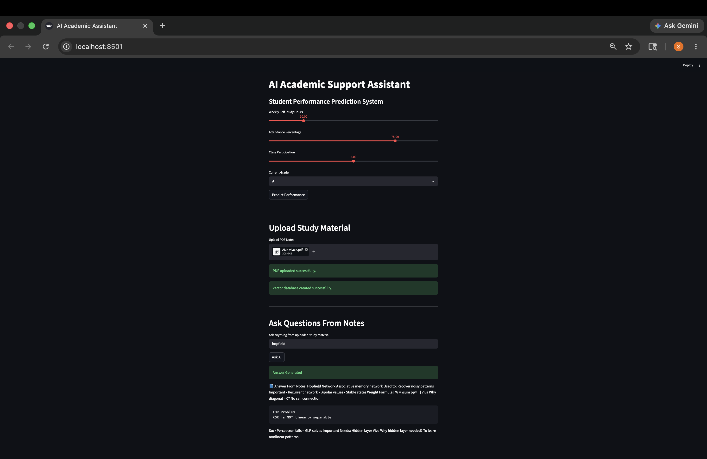

# 🎓 AI Academic Support Assistant

An AI-powered academic assistant built using Streamlit, LangChain, ChromaDB, HuggingFace embeddings, and PyTorch for academic query retrieval and student performance prediction.

---

## 🚀 Features

- 📄 PDF-based academic question answering
- 🧠 Semantic search using vector embeddings
- 🔍 Retrieval-Augmented Generation (RAG) pipeline
- 📊 Student performance prediction using deep learning
- 💻 Interactive Streamlit web interface

---

## 🛠️ Tech Stack

- Python
- Streamlit
- PyTorch
- LangChain
- ChromaDB
- HuggingFace Transformers

---

## ▶️ Run Locally

```bash
pip install -r requirements.txt
streamlit run app/main.py

---

 📸 Screenshots


---

📁 Project Structure
ai-academic-support-assistant/
│
├── app/                  # Streamlit application files
├── data/                 # Dataset files
├── documents/            # Uploaded PDF study materials
├── models/               # Saved ML models and vector DB
├── training/             # Model training scripts
│
├── requirements.txt
├── README.md
└── .gitignore

---

👩‍💻 Developed by Samruddhi Bhagwat
